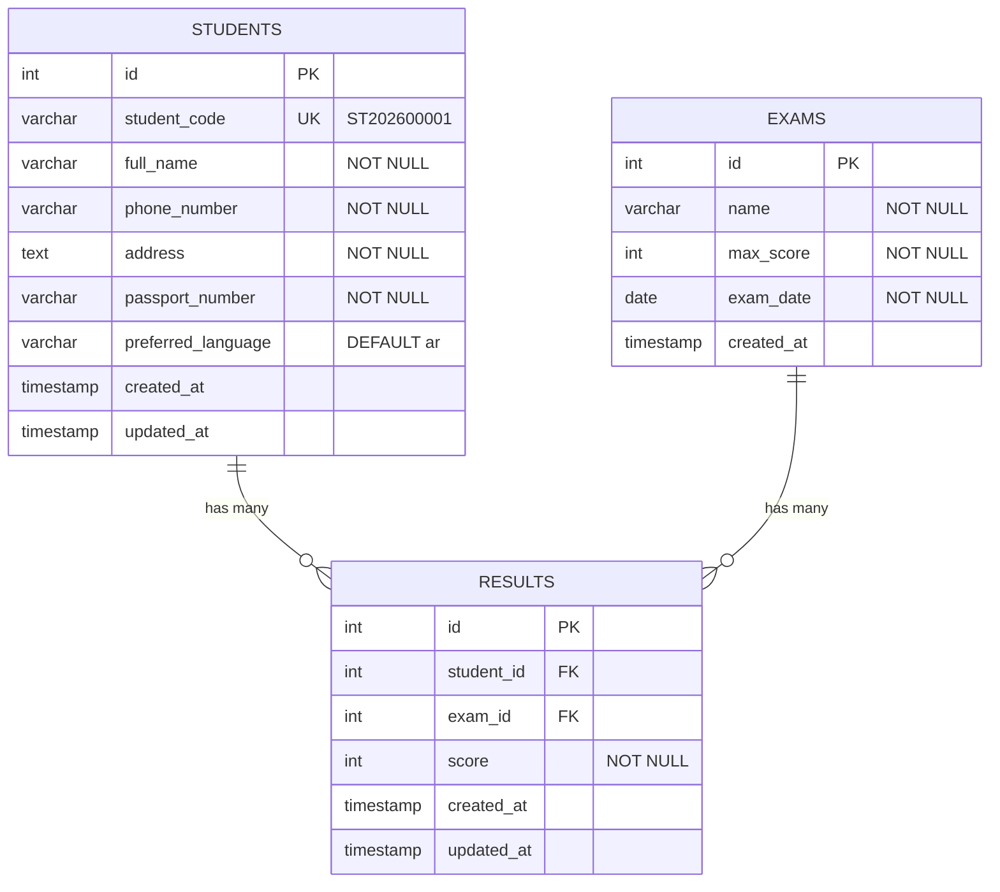

# Arabic Language Learning & Exam Results System — Implementation Plan (v2)

**Version**: 1.0 (MVP)  
**Date**: 2026-09-09  
**Based on**: PRD v1.0 + User Clarifications

---

## 1. Executive Summary

Build a bilingual (Arabic/Russian) web platform where:
- **Students** register for free (no subscriptions), receive a **permanent unique code** (their ID), and use it anytime to look up exam results.
- **Administrators** manage students, exams, and scores via **Django's built-in admin dashboard**.

---

## 2. Confirmed Decisions

| # | Decision | Resolution |
|---|---|---|
| 1 | **Student registration** | Free signup, no subscriptions. Student gets a permanent unique code (like an ID). No password needed — the code IS their identity for checking results. |
| 2 | **Registration fields** | Only: Full Name, Phone, Address, Passport Number (+ auto-detected preferred language) |
| 3 | **Admin authentication** | Django's built-in auth system |
| 4 | **Deployment** | Decided after full stack is complete |
| 5 | **Admin dashboard** | Django's built-in admin (customized with Jazzmin theme) — no custom React admin pages |
| 6 | **Student code prefix** | `ST` format: `ST202600001`, `ST202600002`, etc. |

---

## 3. Tech Stack

| Layer | Technology | Why |
|---|---|---|
| **Backend** | Django 5.x + Django REST Framework | Built-in admin, ORM, auth, migrations |
| **Database** | PostgreSQL 16 | Robust, scalable, native UTF-8 for Arabic/Russian |
| **Frontend** | React 18 + Vite + TypeScript | 3 public pages only (Home, Register, Results) |
| **i18n (Frontend)** | react-i18next | Arabic/Russian language switching |
| **i18n (Backend)** | Django's built-in i18n | Admin + API error messages |
| **Styling** | Tailwind CSS 3 | RTL support built-in (Arabic) |
| **Admin Theme** | django-jazzmin | Modern look for Django admin |
| **Containerization** | Docker + Docker Compose | Consistent dev environment |

---

## 4. Project Structure

```
arabic-learning-system/
├── backend/                          # Django project
│   ├── manage.py
│   ├── requirements.txt
│   ├── config/                       # Django project config
│   │   ├── __init__.py
│   │   ├── settings.py
│   │   ├── urls.py
│   │   └── wsgi.py
│   ├── apps/
│   │   ├── students/                 # Student registration & management
│   │   │   ├── models.py
│   │   │   ├── serializers.py
│   │   │   ├── views.py
│   │   │   ├── urls.py
│   │   │   ├── admin.py
│   │   │   ├── services.py          # Code generation logic
│   │   │   ├── validators.py
│   │   │   └── tests.py
│   │   ├── exams/                    # Exam definitions
│   │   │   ├── models.py
│   │   │   ├── admin.py
│   │   │   └── tests.py
│   │   └── results/                  # Exam results & lookup
│   │       ├── models.py
│   │       ├── serializers.py
│   │       ├── views.py
│   │       ├── urls.py
│   │       ├── admin.py
│   │       ├── services.py
│   │       └── tests.py
│   └── locale/                       # Backend translations
│       ├── ar/LC_MESSAGES/django.po
│       └── ru/LC_MESSAGES/django.po
├── frontend/                         # React app (3 public pages only)
│   ├── package.json
│   ├── tsconfig.json
│   ├── vite.config.ts
│   ├── tailwind.config.ts
│   ├── index.html
│   ├── public/
│   │   └── locales/
│   │       ├── ar/translation.json
│   │       └── ru/translation.json
│   └── src/
│       ├── main.tsx
│       ├── App.tsx
│       ├── i18n.ts
│       ├── api/
│       │   ├── client.ts
│       │   ├── students.ts
│       │   └── results.ts
│       ├── components/
│       │   ├── Layout/
│       │   │   ├── Navbar.tsx
│       │   │   ├── Footer.tsx
│       │   │   └── LanguageSwitcher.tsx
│       │   ├── Student/
│       │   │   └── RegistrationForm.tsx
│       │   └── Results/
│       │       ├── ResultSearch.tsx
│       │       └── ResultDisplay.tsx
│       ├── pages/
│       │   ├── HomePage.tsx
│       │   ├── RegisterPage.tsx
│       │   └── ResultsPage.tsx
│       ├── hooks/
│       │   └── useDirection.ts
│       └── types/
│           └── index.ts
├── docker-compose.yml
├── Dockerfile.backend
├── Dockerfile.frontend
└── README.md
```

> [!NOTE]
> **No admin React pages.** All admin operations (students, exams, results) are handled through Django's built-in admin at `/admin/`.

---

## 5. Database Design

### 5.1 Entity Relationship Diagram



### 5.2 Django Models

#### `students/models.py`

```python
class Student(models.Model):
    LANGUAGE_CHOICES = [('ar', 'العربية'), ('ru', 'Русский')]

    student_code = models.CharField(max_length=20, unique=True, db_index=True, editable=False)
    full_name = models.CharField(max_length=255)
    phone_number = models.CharField(max_length=20)
    address = models.TextField()
    passport_number = models.CharField(max_length=50)
    preferred_language = models.CharField(max_length=5, choices=LANGUAGE_CHOICES, default='ar')
    created_at = models.DateTimeField(auto_now_add=True)
    updated_at = models.DateTimeField(auto_now=True)
```

#### `exams/models.py`

```python
class Exam(models.Model):
    name = models.CharField(max_length=255)
    max_score = models.PositiveIntegerField()
    exam_date = models.DateField()
    created_at = models.DateTimeField(auto_now_add=True)
```

#### `results/models.py`

```python
class Result(models.Model):
    student = models.ForeignKey('students.Student', on_delete=models.CASCADE, related_name='results')
    exam = models.ForeignKey('exams.Exam', on_delete=models.CASCADE, related_name='results')
    score = models.PositiveIntegerField()
    created_at = models.DateTimeField(auto_now_add=True)
    updated_at = models.DateTimeField(auto_now=True)

    class Meta:
        unique_together = ['student', 'exam']

    @property
    def percentage(self):
        """Calculated dynamically — never stored (per PRD §9)."""
        if self.exam.max_score == 0:
            return 0
        return round((self.score / self.exam.max_score) * 100, 2)
```

### 5.3 Student Code Generation

```python
# students/services.py — Thread-safe unique code generation
def generate_student_code() -> str:
    """Format: ST + YYYY + 5-digit sequence → ST202600001"""
    year = datetime.date.today().year
    prefix = f"ST{year}"
    with transaction.atomic():
        last = Student.objects.filter(
            student_code__startswith=prefix
        ).select_for_update().order_by('-student_code').first()
        next_seq = (int(last.student_code[6:]) + 1) if last else 1
        return f"{prefix}{next_seq:05d}"
```

---

## 6. API Design (Public Endpoints Only)

Since admin is handled by Django's built-in admin, we only need **2 public API endpoints**:

| Method | Endpoint | Description |
|---|---|---|
| `POST` | `/api/students/register/` | Register a new student |
| `GET` | `/api/results/{student_code}/` | Look up results by student code |

### 6.1 Register Student

```http
POST /api/students/register/
```
```json
{
    "full_name": "Ahmed Mohamed",
    "phone_number": "+20101234567",
    "address": "Alexandria, Egypt",
    "passport_number": "P1234567",
    "preferred_language": "ar"
}
```

**Success (201)**:
```json
{
    "message": "تم التسجيل بنجاح",
    "student_code": "ST202600001",
    "full_name": "Ahmed Mohamed"
}
```

> [!WARNING]
> Response **never** includes `passport_number` — per PRD §6.

### 6.2 Look Up Result

```http
GET /api/results/ST202600001/
```

**Found with results (200)**:
```json
{
    "student_name": "Ahmed Mohamed",
    "student_code": "ST202600001",
    "results": [
        {
            "exam_name": "Arabic Placement Exam",
            "score": 120,
            "max_score": 200,
            "percentage": 60.0,
            "exam_date": "2026-09-07"
        }
    ]
}
```

**Code not found (404)**:
```json
{
    "error": "student_not_found",
    "message": "رقم الطالب غير موجود. يرجى التحقق والمحاولة مرة أخرى."
}
```

**No results yet (200)**:
```json
{
    "student_name": "Ahmed Mohamed",
    "student_code": "ST202600001",
    "results": [],
    "message": "لم يتم نشر نتيجتك بعد. يرجى المحاولة لاحقاً."
}
```

---

## 7. Frontend — 3 Public Pages

Since admin is handled by Django, the React frontend is lean — only 3 pages:

| Route | Page | Purpose |
|---|---|---|
| `/` | Home | Welcome page, links to Register and Results |
| `/register` | Register | Registration form (4 fields) → shows unique code on success |
| `/results` | Results | Enter student code → view exam score + percentage |

### 7.1 User Flows

**Registration Flow:**
```
Student → /register → Fill form → Submit
    → Backend generates permanent code
    → Display: "Your student code is: ST202600001"
    → Student saves this code (it's their permanent ID)
```

**Result Check Flow:**
```
Student → /results → Enter code (ST202600001) → Click "Check"
    → Backend finds student + results
    → Display: Name, Score, Percentage
```

### 7.2 Multilingual & RTL

- **Language Switcher** in navbar: `العربية | Русский`
- Arabic → full RTL layout
- Russian → LTR layout
- Language saved in `localStorage`, persists across visits
- All strings in `translation.json` files (no hardcoded text)

**Arabic result view:**
```
نتيجة الامتحان
الطالب: أحمد محمد
الدرجة: 120 / 200
النسبة: 60%
```

**Russian result view:**
```
Результат экзамена
Студент: Ахмед Мохамед
Баллы: 120 / 200
Процент: 60%
```

---

## 8. Admin Dashboard — Django Built-in Admin

Using Django Admin with **Jazzmin** theme for a modern look. Accessed at `/admin/`.

### What admin can do:

| Action | How |
|---|---|
| **Log in** | Django auth at `/admin/login/` |
| **View students** | Students list with search + filters |
| **Add student** | Add form (auto-generates code) |
| **Edit student** | Inline editing |
| **Delete student** | With confirmation |
| **Search students** | By name, code, phone |
| **Create exam** | Name, max score, date |
| **Add result** | Select student + exam, enter score |
| **Update result** | Edit existing score |
| **View dashboard stats** | Student count, exam count, results count |

### Admin configuration (`admin.py` files):

```python
# students/admin.py
@admin.register(Student)
class StudentAdmin(admin.ModelAdmin):
    list_display = ['student_code', 'full_name', 'phone_number', 'preferred_language', 'created_at']
    search_fields = ['student_code', 'full_name', 'phone_number']
    list_filter = ['preferred_language', 'created_at']
    readonly_fields = ['student_code', 'created_at', 'updated_at']
    # passport_number visible only in detail view, not in list

# exams/admin.py
@admin.register(Exam)
class ExamAdmin(admin.ModelAdmin):
    list_display = ['name', 'max_score', 'exam_date']
    search_fields = ['name']
    list_filter = ['exam_date']

# results/admin.py
@admin.register(Result)
class ResultAdmin(admin.ModelAdmin):
    list_display = ['student', 'exam', 'score', 'get_percentage', 'created_at']
    search_fields = ['student__student_code', 'student__full_name']
    list_filter = ['exam', 'created_at']
    autocomplete_fields = ['student', 'exam']

    def get_percentage(self, obj):
        return f"{obj.percentage}%"
    get_percentage.short_description = 'Percentage'
```

> [!NOTE]
> Score validation (`score <= max_score`) is enforced in the `Result` model's `clean()` method — works in both API and Django Admin.

---

## 9. Security

| Concern | Solution |
|---|---|
| **Admin auth** | Django's built-in session auth (proven, secure) |
| **Passport protection** | Never in public API responses. Visible only in Django Admin to authenticated admins |
| **SQL injection** | Django ORM parameterized queries (built-in) |
| **CSRF** | Django CSRF middleware |
| **Input validation** | Serializers (backend) + form validation (frontend) |
| **HTTPS** | Enforced in production via `SECURE_SSL_REDIRECT` |
| **CORS** | `django-cors-headers` — whitelist frontend origin only |
| **Rate limiting** | `django-ratelimit` on registration + result lookup |

---

## 10. Proposed Changes — File-by-File

### Backend — Project Config

| Status | File | Purpose |
|---|---|---|
| [NEW] | `backend/config/settings.py` | Django settings: apps, middleware, DB, i18n, REST framework, Jazzmin, CORS |
| [NEW] | `backend/config/urls.py` | Root URLs: admin + API routes |
| [NEW] | `backend/config/wsgi.py` | WSGI entry point |
| [NEW] | `backend/manage.py` | Django management script |
| [NEW] | `backend/requirements.txt` | Python dependencies |

### Backend — Students App

| Status | File | Purpose |
|---|---|---|
| [NEW] | `backend/apps/students/__init__.py` | App init |
| [NEW] | `backend/apps/students/apps.py` | App config |
| [NEW] | `backend/apps/students/models.py` | `Student` model (code, name, phone, address, passport, language) |
| [NEW] | `backend/apps/students/services.py` | `generate_student_code()` — thread-safe code generation |
| [NEW] | `backend/apps/students/serializers.py` | `StudentRegistrationSerializer` — validates + creates student |
| [NEW] | `backend/apps/students/views.py` | `RegisterStudentView` — public POST endpoint |
| [NEW] | `backend/apps/students/urls.py` | URL: `/api/students/register/` |
| [NEW] | `backend/apps/students/admin.py` | Django admin config with search, filters, readonly code |
| [NEW] | `backend/apps/students/validators.py` | Phone number + passport format validators |
| [NEW] | `backend/apps/students/tests.py` | Unit tests for registration, code gen, validation |

### Backend — Exams App

| Status | File | Purpose |
|---|---|---|
| [NEW] | `backend/apps/exams/__init__.py` | App init |
| [NEW] | `backend/apps/exams/apps.py` | App config |
| [NEW] | `backend/apps/exams/models.py` | `Exam` model (name, max_score, exam_date) |
| [NEW] | `backend/apps/exams/admin.py` | Django admin config |
| [NEW] | `backend/apps/exams/tests.py` | Unit tests |

### Backend — Results App

| Status | File | Purpose |
|---|---|---|
| [NEW] | `backend/apps/results/__init__.py` | App init |
| [NEW] | `backend/apps/results/apps.py` | App config |
| [NEW] | `backend/apps/results/models.py` | `Result` model (student FK, exam FK, score, percentage property) |
| [NEW] | `backend/apps/results/serializers.py` | `ResultLookupSerializer` — public response (no passport) |
| [NEW] | `backend/apps/results/views.py` | `ResultLookupView` — public GET by student code |
| [NEW] | `backend/apps/results/urls.py` | URL: `/api/results/{student_code}/` |
| [NEW] | `backend/apps/results/admin.py` | Django admin config with percentage display |
| [NEW] | `backend/apps/results/services.py` | Percentage calculation logic |
| [NEW] | `backend/apps/results/tests.py` | Unit tests for lookup, percentage, edge cases |

### Backend — Translations

| Status | File | Purpose |
|---|---|---|
| [NEW] | `backend/locale/ar/LC_MESSAGES/django.po` | Arabic translations for API messages |
| [NEW] | `backend/locale/ru/LC_MESSAGES/django.po` | Russian translations for API messages |

### Frontend — React App (3 Public Pages)

| Status | File | Purpose |
|---|---|---|
| [NEW] | `frontend/package.json` | Dependencies: React, Vite, Tailwind, i18next, Axios |
| [NEW] | `frontend/vite.config.ts` | Vite config with proxy to Django API |
| [NEW] | `frontend/tailwind.config.ts` | Tailwind with RTL plugin |
| [NEW] | `frontend/tsconfig.json` | TypeScript config |
| [NEW] | `frontend/index.html` | HTML entry point |
| [NEW] | `frontend/src/main.tsx` | App bootstrap + i18n init |
| [NEW] | `frontend/src/App.tsx` | Router with 3 routes: /, /register, /results |
| [NEW] | `frontend/src/i18n.ts` | i18next setup (Arabic + Russian) |
| [NEW] | `frontend/src/api/client.ts` | Axios instance with base URL |
| [NEW] | `frontend/src/api/students.ts` | `registerStudent()` API call |
| [NEW] | `frontend/src/api/results.ts` | `lookupResult(code)` API call |
| [NEW] | `frontend/src/types/index.ts` | TypeScript interfaces |
| [NEW] | `frontend/src/hooks/useDirection.ts` | RTL/LTR toggle based on language |
| [NEW] | `frontend/src/components/Layout/Navbar.tsx` | Nav bar + language switcher |
| [NEW] | `frontend/src/components/Layout/Footer.tsx` | Footer |
| [NEW] | `frontend/src/components/Layout/LanguageSwitcher.tsx` | `العربية \| Русский` toggle |
| [NEW] | `frontend/src/components/Student/RegistrationForm.tsx` | 4-field form + validation + success display |
| [NEW] | `frontend/src/components/Results/ResultSearch.tsx` | Code input + search button |
| [NEW] | `frontend/src/components/Results/ResultDisplay.tsx` | Score + percentage display (bilingual) |
| [NEW] | `frontend/src/pages/HomePage.tsx` | Welcome page with links |
| [NEW] | `frontend/src/pages/RegisterPage.tsx` | Registration page |
| [NEW] | `frontend/src/pages/ResultsPage.tsx` | Results lookup page |
| [NEW] | `frontend/public/locales/ar/translation.json` | All Arabic UI strings |
| [NEW] | `frontend/public/locales/ru/translation.json` | All Russian UI strings |

### Infrastructure

| Status | File | Purpose |
|---|---|---|
| [NEW] | `docker-compose.yml` | Services: Django backend, PostgreSQL, React (dev) |
| [NEW] | `Dockerfile.backend` | Python 3.12 + Django |
| [NEW] | `Dockerfile.frontend` | Node 20 + React build |
| [NEW] | `README.md` | Setup instructions |

**Total: ~45 new files**

---

## 11. Implementation Phases

### Phase 1: Scaffolding (Day 1)
- [ ] Initialize Django project with 3 apps (students, exams, results)
- [ ] Initialize React project with Vite + TypeScript + Tailwind
- [ ] Set up Docker Compose with PostgreSQL
- [ ] Configure Django settings, CORS, REST Framework, Jazzmin
- [ ] Create database, run initial migrations

### Phase 2: Backend Models & Admin (Day 1–2)
- [ ] Create Student model + migration
- [ ] Create Exam model + migration
- [ ] Create Result model + migration (with unique_together, clean validation)
- [ ] Implement `generate_student_code()` service
- [ ] Register all models in Django Admin with search/filter/display
- [ ] Create Django superuser
- [ ] Test admin: add students, exams, results through Django Admin

### Phase 3: Backend APIs (Day 2–3)
- [ ] Student registration serializer + view + URL
- [ ] Result lookup serializer + view + URL
- [ ] Input validation + error responses
- [ ] Arabic/Russian API message translations
- [ ] Write unit tests for all endpoints

### Phase 4: Frontend (Day 3–5)
- [ ] Set up i18n (Arabic + Russian translation files)
- [ ] Build Layout: Navbar, Footer, Language Switcher
- [ ] Build Home Page
- [ ] Build Registration Page + form with validation
- [ ] Build Results Page (search + result display)
- [ ] Implement RTL support (Arabic)
- [ ] Connect to backend APIs via Axios
- [ ] Handle all error states (not found, no results, validation errors)

### Phase 5: Polish & Testing (Day 5–6)
- [ ] Complete all translation strings
- [ ] End-to-end test: register → admin adds result → student checks result
- [ ] Cross-browser test (RTL/LTR)
- [ ] Rate limiting on public endpoints
- [ ] README with setup instructions
- [ ] Docker production configuration

---

## 12. Verification Plan

### Automated Tests

```bash
cd backend && python manage.py test
```

**Key test cases:**
- Student code uniqueness (generate 100 codes, all unique)
- Registration with valid data → 201 + code returned
- Registration with missing field → 400 + validation error
- Result lookup with valid code + results → 200 + score + percentage
- Result lookup with valid code + no results → 200 + "not published" message
- Result lookup with invalid code → 404
- Score > max_score → rejected
- Percentage: `(120/200) × 100 = 60%`
- Percentage: `(0/200) × 100 = 0%`
- Passport number NOT in result API response

### Manual Verification

| # | Scenario | Expected |
|---|---|---|
| 1 | Register student with all 4 fields | Code displayed (e.g., ST202600001) |
| 2 | Register with missing field | Validation error in current language |
| 3 | Student checks result with code | Score + percentage shown |
| 4 | Student checks with invalid code | "Not found" message |
| 5 | Student has no results yet | "Not published yet" message |
| 6 | Switch to Arabic | Full RTL layout, Arabic labels |
| 7 | Switch to Russian | LTR layout, Russian labels |
| 8 | Admin logs into `/admin/` | Django admin dashboard |
| 9 | Admin adds student | Code auto-generated |
| 10 | Admin adds result (score > max) | Validation error |
| 11 | Admin adds valid result | Visible to student immediately |
| 12 | Passport number in result API | **Must NOT appear** |

---

## 13. Complete User Scenario (End-to-End)

```
Step 1 — Student registers at /register
         Name: Ahmed Mohamed
         Phone: +20101234567
         Address: Alexandria, Egypt
         Passport: P1234567
         → System shows: "Your code is ST202600001"
         → Student saves this code permanently

Step 2 — Admin logs into /admin/
         Creates exam: "Arabic Placement Exam", max: 200
         Adds result: Student ST202600001, Score: 120

Step 3 — Student visits /results
         Enters: ST202600001
         Clicks: "Check Result"

Step 4 — System displays:
         ┌─────────────────────────────┐
         │     نتيجة الامتحان          │
         │                             │
         │  الطالب: أحمد محمد           │
         │  الامتحان: Arabic Placement  │
         │  الدرجة: 120 / 200          │
         │  النسبة: 60%                │
         └─────────────────────────────┘

Step 5 — Next time, same student uses
         SAME code (ST202600001) to check
         new exam results. Code is permanent.
```
